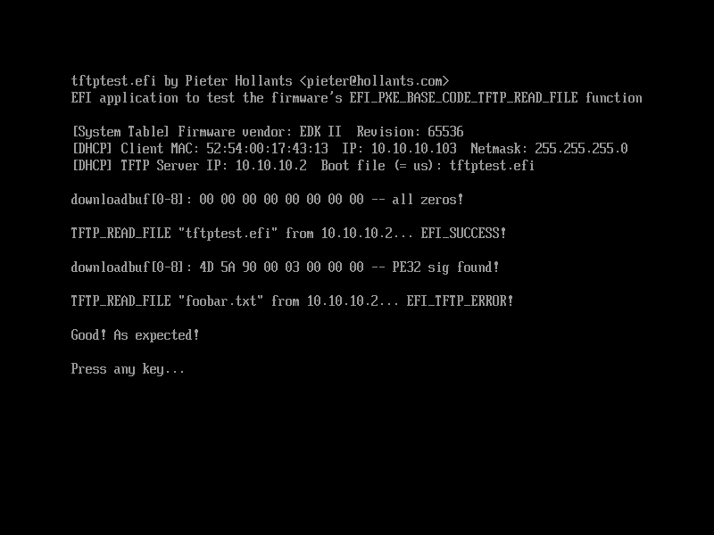

# tftptest.efi

Copyright (c) 2020 Pieter Hollants <pieter@hollants.com>

Licensed under the GNU Public License (GPL) version 3

## What is it?

*tftptest.efi* is a minimal EFI application designed to test an x86_64 UEFI
firmware's `EFI_PXE_BASE_CODE_TFTP_READ_FILE` function. I wrote it as a testcase
because I stumbled over a firmware bug while testing PXE booting in UEFI mode.

You will probably know PXE booting with legacy BIOSes: here a network adapter
has an option ROM (physically present on a plugged-in card or part of the
mainboard's BIOS in case of onboard adapters) which, if enabled, contains a
minimal IPv4 stack and implementations of DHCP and TFTP in addition to the
NIC-specific driver.

With UEFI, the IPv4 implementation is instead generic and part of a
mainboard's firmware and also includes an HTTP client implementation so
clients can boot a boot loader directly off an HTTP server. TFTP booting
is however still officially supported and often the easier option if you
need to support both legacy BIOS and UEFI booting. Note that because the
mainboard firmware already contains all generic parts, the network
adapter's option ROM now only contains an UEFI-compatible driver.

It turns out, however, that TFTP operations have not been tested in all
UEFI firmwares extensively. *tftptest.efi*'s only purpose is to test a
particular UEFI firmware for a bug in a particular function that is
commonly used to download a file from the TFTP server,
`EFI_PXE_BASE_CODE_TFTP_READ_FILE`.

## How do I use and what does it do?

- Set up a PXE server for testing purposes. This involves:
  - setting up a TFTP server such as *in.tftpd* or *atftpd*. Copy `tftptest.efi`
    to its TFTP root directory, e.g. `/var/lib/tftproot` or `/srv/tftproot`.
  - setting up a DHCP server such as *ISC dhcpd* or *dnsmasq*. Configure it
    to tell clients to boot tftptest.efi off the TFTP server.
- Configure the client to be tested to boot in UEFI mode (NOT legacy BIOS
  mode!)
- Initiate PXE booting on the client, e.g. from the one-time boot menu.
- The client's UEFI firmware will initialize the network adapter and
  send a DHCP request.
- Your DHCP server will offer it IP configuration parameters and also
  tell it to TFTP-boot `tftptest.efi` from your TFTP server.
- The client's UEFI firmware will configure the network adapter with
  the supplied parameters.
- Next it sends a TFTP GET request to your TFTP server for `tftptest.efi`.
- *tftptest.efi* is downloaded and started.

What then happens is:
- *tftptest.efi* will use UEFI firmware calls to determine the network
  device it was booted from and obtain its IP/DHCP/PXE configuration
- It will prepare a buffer for TFTP download tests. This buffes is
  initialized with zeros.
- It will then call the UEFI firmware's `EFI_PXE_BASE_CODE_TFTP_READ_FILE`
  function to download itself, i.e. `tftptest.efi`, into the prepared
  buffer. This simply because we KNOW that by the fact of our code
  being currently executed that `tftptest.efi` *does* exist on the TFTP
  server.
- The UEFI firmware downloads `tftptest.efi` into the download buffer.
- *tftptest.efi* displays the first 8 bytes of the buffer and does a
  quick check on the first two bytes to ensure that a PE32 signature is
  found. All EFI executables such as *Grub2*, *ELILO*, *iPXE*, the Windows
  boot loader etc. are PE32 executables whose first two bytes are always
  0x5A 0x4D.
- *tftptest.efi* will then do *another* `EFI_PXE_BASE_CODE_TFTP_READ_FILE`
  request but this time for a file `foobar.txt` that is supposed to *not*
  exist on the TFTP server.
- The UEFI firmware tries to download `foobar.txt`.
- The TFTP server tells it "Nope, sorry, this file doesn't exist!"

And this is where the interesting stuff happens:
- A proper UEFI firmware would then return a TFTP error to *tftptest.efi*.

  You can see this behavior here:
  .

  Because *tftptest.efi* knows this second TFTP GET request failed, it
  knows it can't trust the contents of the download buffer.
- The buggy UEFI firmware I encountered however returns "Success!" although
  the file didn't exist!
  
  *tftptest.efi* will show the contents of the download buffer once again
  and you will see that they still contain the first eight bytes of
  *tftptest.efi*... which is really bad, because a proper bootloader such
  as *ELILO* will now assume that the TFTP GET request was successful and
  the buffer contains valid data. Boom!

## Compiling

For your convenience I included a readily compiled version of *tftptest.efi*.
If you don't trust it you can recompile *tftptest.efi* yourself: a `Makefile`
is included. You will need to have *gcc* and *gnu-efi* development files
installed and might have to change the include paths in the `Makefile`.

## License

This software is licensed under the GNU Public License (GPL), version
3.0. See [http://www.gnu.org/licenses/gpl-3.0.txt](http://www.gnu.org/licenses/gpl-3.0.txt) or the included file
`LICENSE`.
